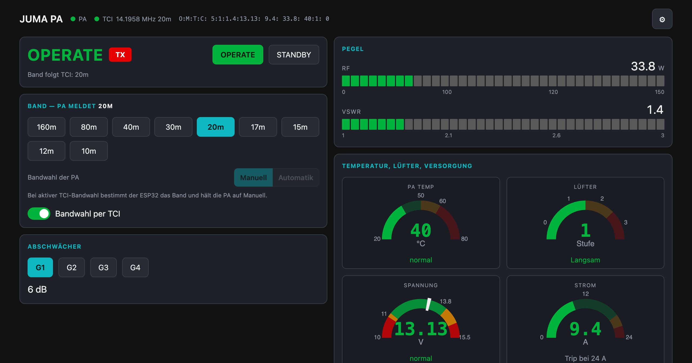
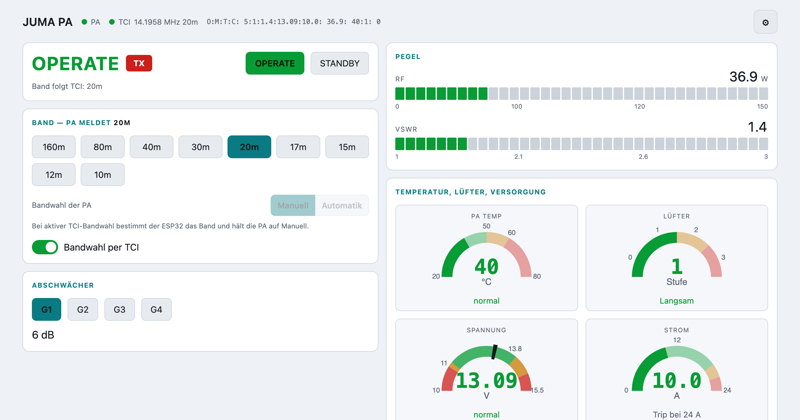
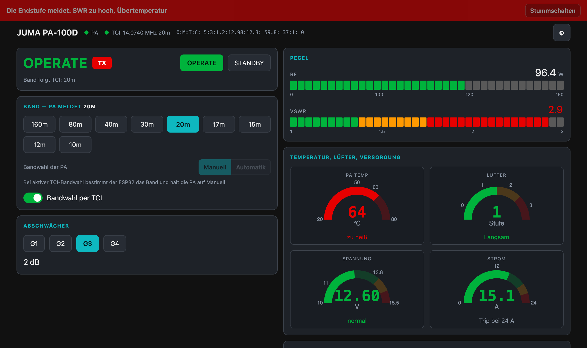
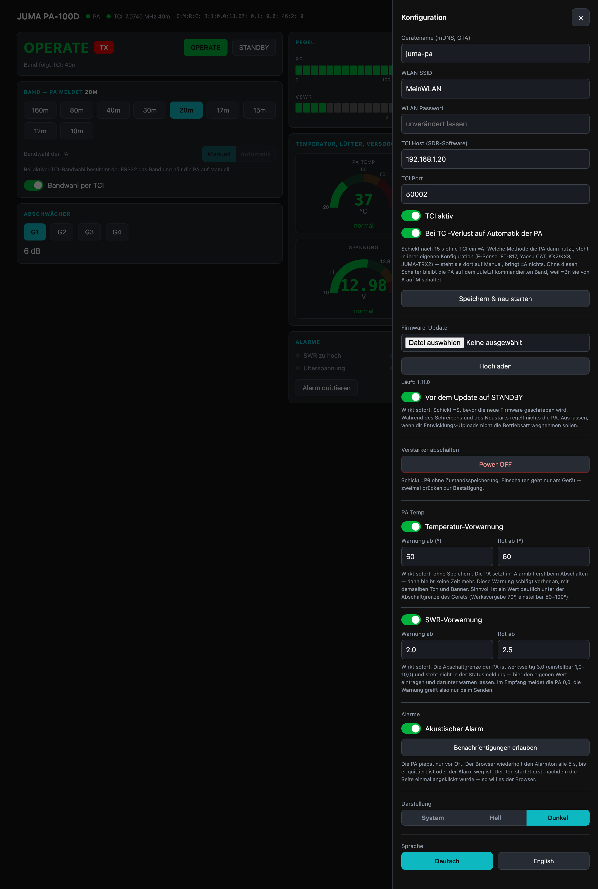
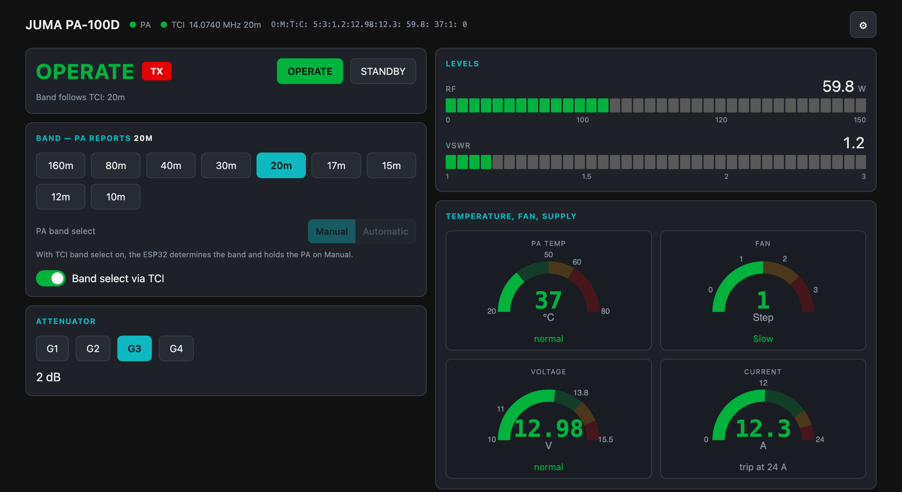

# JUMA PA-100D Controller auf ESP32

Steuert die Endstufe **JUMA PA-100D** über ihren RS-232-Port. Web-Dashboard per
WLAN, automatische Bandwahl über **TCI** (ExpertSDR, deskHPSDR, Thetis),
OTA-Updates und eine Diagnosekonsole über Telnet — alles auf einem ESP32 für
ein paar Euro.



```
SDR-Software ──TCI (WebSocket)──► ESP32 ──UART2──► MAX3232 ──RS-232──► JUMA PA-100D
                                    │
                 Browser ◄──HTTP :80 + WebSocket :81
```

- alle 13 Statusfelder der PA live im Browser, Pegelbalken und Rundanzeigen
- Bandwahl folgt der QRG der SDR-Software, mit Beruhigungszeit und TX-Sperre
- Bedienung von OPERATE/STANDBY, Band, Abschwächer und Alarmquittierung
- Alarm mit Ton, Banner und blinkendem Tab-Titel — die PA piepst nur vor Ort
- Oberfläche auf Deutsch und Englisch, hell und dunkel
- Firmware-Update über WLAN, ohne USB-Kabel am Verstärker
- Telnet-Konsole für Konfiguration und Fehlersuche

Die Screenshots zeigen echten Betrieb — 59,8 W auf 20 m, SWR 1,2, 12,3 A, und
die Versorgung bricht unter Last von 13,68 V auf 12,98 V ein. Ersetzt sind nur
SSID und TCI-Host.

<table>
<tr>
<td width="50%"><a href="docs/dashboard-light.png"></a></td>
<td width="50%"><a href="docs/alarm.png"></a></td>
</tr>
<tr>
<td>Helles Theme — System, Hell oder Dunkel</td>
<td>Alarm: Banner, Ton und blinkender Tab-Titel</td>
</tr>
<tr>
<td><a href="docs/settings-de.png"></a></td>
<td><a href="docs/dashboard-en.png"></a></td>
</tr>
<tr>
<td>Konfiguration hinter dem Zahnrad</td>
<td>Dieselbe Oberfläche auf Englisch</td>
</tr>
</table>

> **Ohne Gewähr.** Diese Firmware schaltet die Bandfilter einer Endstufe. Ein
> falsches Filter kann die Ausgangsstufe zerstören. Vor dem ersten scharfen
> Betrieb die Verkabelung mit dem eingebauten RS-232-Loopback-Test der PA prüfen
> und die Bandumschaltung in STANDBY durchspielen.

---

## Hardware

Gebraucht werden ein ESP32 (getestet auf ESP32-WROOM, 4 MB Flash) und ein
**MAX3232**-Pegelwandler. Die PA hat echte RS-232-Pegel — das Manual sagt dazu
ausdrücklich „designed to provide and accept the standard levels" —, ein
direkter Anschluss an den ESP32 zerstört dessen Eingang.

**MAX232 ist der falsche Typ**: er läuft nur an 5 V, und sein Empfängerausgang
schwingt auf 5 V gegen einen 3,3-V-Eingang.

### Verdrahtung

Die RS-232-Buchse der PA-100D ist eine **3,5-mm-Stereoklinke**, keine DB9.

| ESP32 | MAX3232-Modul | JUMA (3,5-mm-Klinke) |
|---|---|---|
| GPIO17 (`TX2`, U2TXD) | TTL **TXD** | RS-232-Treiberausgang → **Tip** |
| GPIO16 (`RX2`, U2RXD) | TTL **RXD** | RS-232-Empfängereingang → **Ring** |
| 3V3 | VCC | — |
| GND | GND | **Sleeve** |

Das Modul **an 3,3 V** betreiben, nicht an 5 V.

GPIO16/17 sind die Standardpins von UART2 und auf WROOM-Modulen frei. Auf
**WROVER** belegt das PSRAM diese Pins — dort z. B. 25/26 nehmen und
`include/config.h` anpassen. UART0 bleibt die USB-Konsole.

### Welches Pad ist welches?

Die Beschriftung der Billigmodule ist uneinheitlich — manche labeln die TTL-,
manche die RS-232-Seite, und die ganz kleinen Platinen verzichten auf Text
komplett. **Eine einzige Messung löst das variantenunabhängig auf:**

1. Nur **3,3 V und GND** anlegen, sonst nichts — keine Verbindung zur PA.
2. Alle Datenpins gegen GND messen. Genau einer steht bei ca. **−5,5 V**: das
   ist der **RS-232-Treiberausgang** → an **Tip** der Klinke.
3. Der andere RS-232-Pin ist der Empfängereingang → an **Ring**.

Gegenprobe an der PA: **Ring gegen Sleeve** muss im Ruhezustand ca. **−5 V**
zeigen, RS-232-Mark ist negativ. Zeigt stattdessen Tip das, stehen die Jumper
auf dem Frequency-Sense-Board in der „software update"-Stellung und Tip/Ring
sind vertauscht.

#### Beispiel: „mini RS232 ↔ TTL"-Platine mit MAX3232ESE+

Die verbreitete Streichholzschachtel-Platine (ca. 2 €) ist elektrisch passend —
richtiger Chip, 3,0–5,5 V, Ladungspumpen-Kondensatoren an Bord —, hat aber
**keine Steckverbinder und keine Textbeschriftung**. Acht Lötpads, vier je
Seite, nur mit Symbolen versehen:

| Symbol | Bedeutung |
|---|---|
| `\|` | GND |
| `+` | VCC |
| `→` / `←` | Datenrichtung durch die Platine |

VCC und GND liegen auf **beiden** Seiten, die Versorgung kann also von der
bequemeren Seite kommen. Welche physische Seite RS-232 ist und welche TTL,
steht nirgends — mit der Messung oben braucht man es auch nicht zu wissen:

1. Das Pad mit ca. **−5,5 V** ist der RS-232-Treiberausgang → **Tip**.
2. Dessen **Pfeilrichtung** merken. Das Pad mit demselben Pfeil auf der anderen
   Seite ist der zugehörige TTL-Eingang → **GPIO17**.
3. Das andere Pfeilpaar ist der Gegenweg: RS-232-Eingang → **Ring**,
   TTL-Ausgang → **GPIO16**.

### HF-Umgebung

Das Gerät sitzt neben einem 100-W-Linear:

- Kabel kurz und geschirmt, Ferritkern über die Klinkenleitung
- je 100 nF von TX/RX nach GND direkt am MAX3232
- ESP32 in ein Metallgehäuse
- die Versorgung **nicht** ungefiltert von den 13,8 V der PA abzweigen
- gegen Masseschleifen: ein isolierter Transceiver (z. B. ADM3251E) statt des
  MAX3232

### Einstellungen an der PA

Drei Punkte müssen stimmen, sonst antwortet die PA überhaupt nicht:

| | |
|---|---|
| Serial Speed | **115200** (Werkseinstellung ist 9600) |
| Serial Port Mode | **Remote** |
| Auto Band Detect | **F-Sense** oder **FT-817** |

Der letzte Punkt ist keine Schikane: laut Manual sind Remote- und Test-Modus
nur bei diesen beiden Einstellungen überhaupt aktiv.

### Bench-Test ohne PC

Die PA hat einen eingebauten Loopback-Test: **DISPLAY/CONFIG aus dem
Off-Zustand halten und einschalten**. Damit lässt sich die Verkabelung prüfen,
bevor das erste Bandkommando fliegt. Beenden mit kurzem PWR-Druck.

---

## Inbetriebnahme

### Passwörter setzen

Es gibt zwei, beide stehen als **Platzhalter** in `include/config.h` und müssen
vor dem Einsatz ersetzt werden:

| Konstante | Platzhalter | schützt |
|---|---|---|
| `OTA_PASSWORD` | `changeme` | Firmware-Upload — Basic-Auth `admin` / Passwort auf `POST /update`, ebenso espota |
| `AP_PASSWORD` | `changeme01` | den Notfall-AP `JUMA-PA`, wenn kein WLAN konfiguriert ist |

Das erste ist das wichtigere: wer das Gerät im Netz erreicht, kann damit eine
beliebige Firmware aufspielen.

Gesetzt werden sie in **`platformio_local.ini`** — die Datei steht in der
`.gitignore` und landet damit nie im Repo:

```ini
; platformio_local.ini
[secrets]
flags =
    -DAP_PASSWORD='"deinAPpasswort"'      ; mindestens 8 Zeichen
    -DOTA_PASSWORD='"deinOTApasswort"'
```

Die versionierte `platformio.ini` bindet sie über `extra_configs` ein und hält
selbst nur einen leeren `[secrets]`-Abschnitt. **Fehlt die lokale Datei, baut
das Projekt trotzdem** und fällt auf die Platzhalter aus `config.h` zurück — für
den ersten Versuch am Schreibtisch reicht das, für den Betrieb nicht.

Zwei Dinge, die dabei auffallen:

- **Henne und Ei.** Der Upload, der das neue Passwort installiert, braucht noch
  das **alte**. Einmalig also `JUMA_OTA_PASS=changeme ./tools/flash-wifi.sh`,
  danach nicht mehr.
- `tools/flash-wifi.sh` liest das Passwort selbst aus `platformio_local.ini`,
  wenn `JUMA_OTA_PASS` nicht gesetzt ist — dieselbe Quelle, aus der auch die
  Firmware gebaut wurde, also kein zweiter Ort zum Pflegen.

### Bauen und flashen

```sh
pio run                                  # bauen
pio run -t upload                        # erstes Mal per USB
./tools/flash-wifi.sh juma-pa.local      # danach über WLAN
./tests/run.sh                           # Hosttests, kein ESP32 nötig
```

### WLAN einrichten

Drei gleichwertige Wege:

1. **Serialkonsole** (`pio device monitor`), direkt beim Flashen:
   ```
   scan                  # Netze auflisten
   ssid MeinNetz
   pass geheim123
   save                  # speichert in NVS und startet neu
   ```
2. **Telnet**, sobald WLAN steht: `telnet juma-pa.local`, dieselben Kommandos.
3. **AP-Fallback**: ohne gültige Konfiguration spannt der ESP32 den AP
   **`JUMA-PA`** auf, Dashboard auf `http://192.168.4.1/`.

Hidden SSIDs funktionieren — der ESP32 sucht sie per aktivem Scan.

Der **Gerätename** ist einstellbar (Default `juma-pa`) und gilt für
WLAN-Hostname, mDNS und OTA — das Dashboard liegt danach unter
`http://<name>.local/`. Erlaubt sind Kleinbuchstaben, Ziffern und Bindestriche.

---

## Bedienung

Das Dashboard ist ab 900 px Breite zweispaltig und zeigt alle 13 Statusfelder
gleichzeitig. Die Konfiguration liegt hinter dem Zahnrad, damit im Hauptbild nur
steht, was im Betrieb gebraucht wird.

### Pegelanzeigen

| Anzeige | Bereich | warn ab | hoch ab | Darstellung |
|---|---|---|---|---|
| RF | 0–150 W | 100 | 120 | Segmentbalken, 36 Segmente |
| VSWR | 1–3 | einstellbar, Vorgabe 2,0 | einstellbar, Vorgabe 2,5 | Segmentbalken |
| PA Temp | 20–80 °C | 50 | 60 | Rundanzeige, 180° |
| Lüfter | 4 Stufen | Mittel | Schnell | Rundanzeige mit Stufentext |
| Spannung | 10–15,5 V | < 11,2 / > 14,0 | < 11,0 / > 14,8 | Rundanzeige |
| Strom | 0–24 A | 19,2 | 21,6 | Rundanzeige |

Die Spannungsgrenzen sind die **Defaults der PA**: Unterspannung 11,00 V,
Vorwarnung 11,20 V, Überspannung 14,80 V (ab 14,00 V einstellbar), Nennspannung
13,80 V. Beim Strom nennt das Manual nur den **24-A-Hardware-Trip** des MAX4373
— der ist auch beim geräteeigenen Zeigerinstrument der Vollausschlag. Die
Warnzonen bei 80 % und 90 % davon sind abgeleitet. Stehen an der eigenen PA
andere Schwellen, die Konstanten in `src/index_html.h` anpassen.

Die Temperaturanzeige folgt der Einheit der PA: meldet sie `F`, wechseln
Beschriftung und Einheit auf Fahrenheit, die Zonen bleiben dieselben
Temperaturen.

**Die Temperaturzonen sind Werte des Dashboards, keine der PA.** Das Gerät
selbst kennt zwei einstellbare Schwellen, und keine davon steht in der
Statusmeldung:

| | Default | einstellbar |
|---|---|---|
| Over-Temperature Limit | **70 °C** | 50–100 °C |
| Fan Cut-In Temperature | 40 °C | 0–80 °C |

Ab der Abschaltschwelle setzt die PA das Alarmbit und läuft der Lüfter auf
Maximum. Wer sein Gerät auf einen anderen Wert eingestellt hat, passt `TWARN`
und `THIGH` in `src/index_html.h` entsprechend an — sinnvoll ist eine Warnzone
deutlich **unter** der Abschaltschwelle, weil das Alarmbit erst beim Auslösen
kommt und dann keine Zeit mehr bleibt.

Ein Lüfter auf Stufe 3 ist dabei selbst ein Frühwarnzeichen: er springt per
Default schon bei 40 °C an und läuft nur unter Last ganz hoch.

Die Warnschwelle treibt beide Dinge: die orange Zone der Anzeige **und** die
Vorwarnung mit Ton und Banner. Sie sollte deutlich unter der Abschaltgrenze des
Geräts liegen.

**Eingangsleistung gibt es nicht.** Die PA misst HF nur am Ausgang — Kanal 12
rückwärts, Kanal 13 vorwärts, daraus Ausgangsleistung und SWR. Ein Messpunkt
für die Ansteuerung existiert im Gerät nicht.

Farben: normal `#00b33c`, warn `#ff9900`, hoch `#e60000`, unbeleuchtet
`#595959`. Die Segmente sind nach ihrer **eigenen** Position gefärbt — der
Balken zeigt also durchgehend die Zonen, statt bei Überschreitung komplett
umzuschlagen. Nur Zahl und Stufentext nehmen die Farbe der aktuellen Zone.

### Sprache

Deutsch und Englisch, umschaltbar in den Einstellungen. Die Wahl liegt im
`localStorage` des Browsers, jedes Gerät behält also seine eigene; beim ersten
Aufruf entscheidet `navigator.language`.

Damit das vollständig funktioniert, schickt die Firmware **keine fertigen
Texte**: Hinweise gehen als Code plus Argument raus (`tcidis`,
`unsupported`+Band, `bandok`+Band …), und `/api/config` antwortet mit `saved`
statt einem deutschen Satz.

Im Wörterbuch dürfen **keine HTML-Entities** stehen — die Texte werden per
`textContent` gesetzt, `&amp;` erschiene wörtlich.

### Alarmmeldung

Die PA piepst bei einem Alarm — aber nur vor Ort. Das Dashboard macht daraus:

- ein rotes Banner am oberen Rand mit den betroffenen Alarmen
- einen Alarmton, alle 5 s wiederholt, bis quittiert oder Alarm weg
- einen blinkenden Tab-Titel, damit es auch im Hintergrund auffällt

**Zusätzlich warnt das Dashboard vor der Abschaltung.** Das Alarmbit der PA
kommt erst, wenn sie sich wegen Übertemperatur abschaltet — und dann bleibt
keine Zeit mehr zu reagieren; mit der Abschaltung stirbt auch die serielle
Verbindung, die Meldung käme also nie an. Überschreitet die Temperatur die
eingestellte Warnschwelle, schlagen deshalb dasselbe Banner und derselbe Ton an,
auch wenn die PA noch keinen Alarm meldet. Schwelle und Rotzone sind in den
Einstellungen konfigurierbar (`tempwarn`, `temphigh`, `tempalarm`), Vorgabe
50 ° und 60 °.

Dasselbe gilt für das SWR: die Abschaltgrenze der PA ist werksseitig **3,0**
(einstellbar 1,0–10,0) und steht ebenfalls nicht in der Statusmeldung. Warnung
und Rotzone sind über `swrwarn`, `swrhigh` und `swralarm` einstellbar, Vorgabe
2,0 und 2,5. Im Empfang meldet die PA 0,0 — die Warnung greift also nur beim
Senden, und das Alarmbit der PA käme erst beim Auslösen der Abschaltung.

Diese Einstellungen wirken **sofort**, ohne „Speichern & neu starten" — genau wie die
Bedienelemente im Hauptbild. Sie brauchen keinen Neustart, und ein Schalter,
der erst durch einen weit entfernten Speichern-Knopf wirksam wird, sieht aus,
als täte er nichts. Dasselbe gilt für „Vor dem Update auf STANDBY".

Der Ton startet erst, nachdem die Seite einmal angeklickt wurde — so verlangt es
die Autoplay-Richtlinie der Browser. Abschaltbar in den Einstellungen.

**Browser-Benachrichtigungen funktionieren über `http://` nicht.** Die
Notification-API ist auf „secure contexts" beschränkt. Tückisch dabei: Chrome
entfernt das `Notification`-Objekt nicht, sondern setzt die Berechtigung
stillschweigend auf `denied` — das sieht aus, als hätte man selbst abgelehnt.
Das Dashboard fragt deshalb `isSecureContext` ab, nennt den echten Grund und
sperrt die Taste. Ton und Banner sind davon unabhängig.

### Darstellung

System, Hell oder Dunkel, umschaltbar in den Einstellungen und im
`localStorage` gemerkt. Ohne Wahl folgt die Seite `prefers-color-scheme`. Die
Signalfarben sind im hellen Theme leicht abgedunkelt — `#ff9900` ist auf Weiß
als Text kaum lesbar.

### Der Hinweis unter dem Zustand

Er zeigt immer den **aktuellen Grund**, nicht ein einmaliges Ereignis; sonst
stünde nach dem Umschalten eine veraltete Meldung da und direkt nach dem Start
gar keine. `bandControl()` setzt ihn in jedem Durchlauf neu:

| Code | Bedeutung |
|---|---|
| `aboff` | TCI-Bandwahl aus |
| `tcioff` / `tcidis` | TCI-Client abgeschaltet / nicht verbunden |
| `tcinofreq` | verbunden, aber noch keine QRG |
| `paoff` | PA antwortet nicht |
| `unsupported` | Band wird von der PA nicht abgedeckt |
| `bandok` / `bandset` | Band folgt TCI / wurde umgeschaltet |
| `tciauto` | TCI weg, PA per `=A` auf ihre eigene Bandwahl zurückgestellt |
| `selstuck` | PA bleibt auf `A`, obwohl die TCI-Bandwahl sie auf `M` holen will |

Nur echte Hindernisse werden orange eingefärbt; „Automatik aus" und „Band folgt
TCI" sind Zustandsinfos.

### Umschalter „Bandwahl der PA"

Zeigt und setzt Feld 2 (`A`/`M`) — den **Zustand** der AUTO-Taste, nicht die
konfigurierte Methode. Die Methode (F-Sense, Yaesu CAT, KX2/KX3, JUMA-TRX2,
FT-817, Manual) steht in der Gerätekonfiguration und taucht in der
Statusmeldung gar nicht auf.

`Auto` schickt `=A`. Für `Manuell` gibt es kein eigenes Kommando — die Firmware
schickt dafür `=B<aktuelles Band>`: laut Manual ist das eine manuelle Bandwahl,
sie schaltet `A` nach `M`, ohne das Band zu ändern.

Der Umschalter ist **gesperrt, solange die TCI-Bandwahl läuft**, und die
Firmware weist den Befehl dann zusätzlich ab. Dort bestimmt der ESP32 das Band
und hält die PA aktiv auf `M` — die beiden dürfen sich die Bandwahl nicht
teilen. Ist die TCI-Bandwahl aus, steht `A` und `M` frei zur Wahl.

---

## Bandautomatik über TCI

TCI ist nicht auf ExpertSDR festgelegt — **deskHPSDR** und **Thetis** sprechen
es ebenfalls, und die Ports unterscheiden sich (ExpertSDR3 40001, deskHPSDR
50002). Host und Port sind deshalb frei einstellbar.

Ausgewertet werden:

| Nachricht | Verwendung |
|---|---|
| `vfo:0,0,<hz>;` | Empfangsfrequenz, Primärquelle |
| `dds:0,<hz>;` + `if:0,0,<offset>;` | Fallback, solange kein `vfo` gesehen wurde |
| `trx:0,<bool>;` | TX-Zustand, sperrt den Bandwechsel |

Die Automatik ist nach einem Reset **aus** (fail-safe) und wird im Dashboard
eingeschaltet; der Zustand liegt in NVS.

1. QRG kommt per TCI.
2. **Settle-Time 150 ms** — erst senden, wenn die QRG stabil steht, sonst feuert
   jedes Drehen über eine Bandgrenze ein Bandkommando.
3. Deckt die PA das Band nicht ab (6 m, 4 m, 2 m, 60 m, LF/MF), geht **kein**
   `=Bn` raus; das Dashboard sagt warum.
4. **Während TX wird nie umgeschaltet** — weder wenn TCI `trx:0,true` meldet
   noch wenn die PA selbst TX anzeigt. Der Wechsel wird nachgeholt.
5. Gesendet wird nur, wenn die PA ein anderes Band meldet als das Ziel. Das
   zieht auch nach, wenn die PA zwischendurch aus war.
6. Meldet die PA `A`, holt der ESP32 sie mit einem `=Bn` auf das laufende Band
   zurück nach `M` — sonst zöge F-Sense sie irgendwann woanders hin. Höchstens
   dreimal im 5-s-Abstand; nimmt die PA es nicht an, wird das gemeldet statt
   endlos gefeuert.

### Fallback bei TCI-Verlust

`=Bn` ist eine *manuelle* Bandwahl und schaltet die PA dabei von `A` nach `M`.
Die PA fällt bei einem TCI-Ausfall deshalb **nicht** von selbst auf ihre eigene
Bandwahl zurück, sondern bleibt auf dem zuletzt kommandierten Band stehen.

Der Schalter **„Bei TCI-Verlust auf Automatik der PA"** (`tcilosta 1`) schickt
15 s nach dem Abriss ein `=A`. **Welche Methode** dann greift, steht in der
Konfiguration der PA; steht sie dort auf `Manual`, bringt `=A` nichts.

Die 15 s liegen bewusst über dem 5-s-Reconnect, damit ein kurzer Aussetzer die
PA nicht umstellt. Gesendet wird einmal pro Abriss, nur wenn TCI vorher
verbunden war, nur wenn die PA online ist und **nicht** während TX. Kommt TCI
zurück, setzt das nächste `=Bn` die PA wieder auf `M`.

### Zwei Fallstricke bei TCI

**`Sec-WebSocket-Protocol` leeren.** `arduinoWebSockets` schickt per Default
`Sec-WebSocket-Protocol: arduino`. deskHPSDR schließt die Verbindung daraufhin
**wortlos** — kein HTTP-Fehler, nur ein TCP-Abbau, der sich als `TIME_WAIT`
zeigt. Isoliert nachgemessen:

```
nur Standard-Header                  -> HTTP/1.1 101 Switching Protocols
+ Sec-WebSocket-Protocol: arduino    -> (keine Antwort)
+ Origin: file://                    -> HTTP/1.1 101 Switching Protocols
+ User-Agent: arduino-...            -> HTTP/1.1 101 Switching Protocols
```

TCI kennt kein Subprotokoll, deshalb ruft `tci.cpp` `ws.begin(host, port, "/", "")`
mit leerem vierten Argument auf. Ohne das verbindet der Client **nie**, und der
Fehler sieht von außen wie ein Netz- oder Firewallproblem aus.

**Ein Client kann TX nicht stoppen.** Naheliegend wäre, bei hohem SWR oder
einem Alarm den Transceiver per TCI aus dem Sendebetrieb zu holen. Gegen
deskHPSDR mit laufendem, lokal getastetem TX gemessen:

```
trx:0,false;         -> keine Wirkung, Server antwortet mit trx:0,true
trx:0,false,tci;     -> keine Wirkung
trx:0,0;             -> keine Wirkung
tx_enable:0,false;   -> keine Wirkung
```

Der Server *liest* das Kommando — er antwortet unmittelbar mit dem aktuellen
Zustand — und lehnt es ab. Vernünftig: ein fremder Prozess soll einem nicht die
Taste wegnehmen können.

`tools/mock-tci.py` ist ein minimaler TCI-Server zum Testen ohne SDR-Software.
`tools/tci-trx-test.py` und `tools/tci-stop-variants.py` prüfen die Frage oben
gegen die eigene Software nach; beide senden nie etwas, das TX *einschaltet*.

---

## Fehlerverhalten

Grundsatz: bei jeder Störung wird **nichts geschaltet**, statt zu raten.

| Störung | Verhalten |
|---|---|
| TCI-Software beendet | Retry alle 5 s, endlos. Kein `=Bn`, die PA bleibt auf ihrem Band. QRG und TX-Zustand werden **verworfen**, nicht eingefroren |
| WLAN weg | ESP32 verbindet selbst neu; die PA wird weiter gepollt, der Serial-Teil hängt nicht am Netz |
| ESP32 startet neu | Poll bricht ab → die PA fällt nach 5 s auf STANDBY, sofern sie *per Fernsteuerung* auf OPERATE stand. Vom Frontpanel gesetztes OPERATE bleibt |
| PA aus / Kabel ab | Nach 3 s `OFFLINE`, keine Bandkommandos, erholt sich selbst |
| Band nicht abgedeckt | Kein `=Bn`, PA bleibt auf dem alten Band, Hinweis erklärt es |
| TX aktiv | Bandwechsel wird zurückgestellt und nachgeholt, sobald TX endet |
| Alarm der PA | Wird angezeigt, **nicht** automatisch quittiert |
| Hauptschleife hängt | Task-Watchdog (20 s) startet neu |
| WLAN bleibt weg | Reconnect alle 15 s, nach 5 Minuten Neustart |
| RSSI dauerhaft schlecht | nach 1 Minute unter −75 dBm neu verbinden, sucht den stärksten AP |

Beim TCI-Abbruch werden QRG und TX-Zustand bewusst zurückgesetzt. Sonst würde
ein eingefrorenes `tx = true` — Abbruch mitten im Senden — den Bandwechsel nach
dem Reconnect **dauerhaft** blockieren. Der Server schickt beim Verbinden ohnehin
den kompletten Zustand neu.

---

## Protokoll der PA

Kommandos in ASCII, terminiert mit `\n\r` (0x0A 0x0D):

| | |
|---|---|
| `=R` | Status abfragen |
| `=O` / `=S` | OPERATE / STANDBY |
| `=A` | automatische Bandwahl der PA |
| `=Bn` | Band, n = 1 (160 m) … 9 (10 m) |
| `=Gn` | Abschwächer, n = 1…4 |
| `=C` | Alarm quittieren |
| `=Pn` | Power off, n = 0 ohne / 1 mit Zustandsspeicherung |

Antwort auf `=R`, **13** Felder, z. B. `O:A:T:C: 5:1:1.0:14.09: 8.1: 27.2: 26:0: 0`:

| # | Wert | Bedeutung |
|---|---|---|
| 1 | `O`/`S` | Operate / Standby |
| 2 | `A`/`M` | Bandwahl automatisch / manuell |
| 3 | `T`/`R` | Transmit / Receive |
| 4 | `C`/`F` | Temperaturskala |
| 5 | 1–9, 10 | Band, 10 = unknown |
| 6 | 1–4 | Abschwächer: G1 = 6 dB, G2 = 4 dB, G3 = 2 dB, G4 = 0 dB |
| 7 | n.n | VSWR |
| 8 | nn.nn | Versorgungsspannung |
| 9 | nn.n | Strom |
| 10 | nnn.n | Ausgangsleistung |
| 11 | nnn | Temperatur |
| 12 | 0–3 | Lüfter: aus / langsam / mittel / schnell |
| 13 | **HH** | Alarme, **hexadezimal** |

Alarmbits: 0 High SWR · 1 Over-Current · 2 High Temperature · 3 High Voltage ·
4 Low Voltage Pre-Limit · 5 Low Voltage Final Limit.

### Drei Dinge, die das Manual so nicht hergibt

**Feld 13 ist hexadezimal.** Wer es dezimal liest, dekodiert ab `0x0A` falsch:
`10` (Low Voltage Pre-Limit, Bit 4) erscheint dann als Over-Current + High
Voltage. `tests/test_parse.cpp` prüft genau das.

**Der Zeilenterminator ist drei Bytes.** Gemessen: 45 Bytes pro Zeile bei 42
Zeichen Nutzlast, und der Hexdump endet reproduzierbar auf `0D 0A 0D`
(CR LF CR) — nicht das dokumentierte `\n\r`. Der Parser behandelt jedes CR und
LF als Zeilenende und verwirft Leerzeilen. Wer exakt auf `\n\r` matcht,
verlässt sich darauf, dass die überzähligen Bytes zufällig harmlos landen.

**Der Abschwächer ist pro Band gespeichert.** Beim Bandwechsel springt Feld 6
mit — das ist kein Fehler der Firmware.

Dazu zwei Punkte, die im Manual stehen, aber leicht übersehen werden: die PA
fällt **5 s** nach einem fernbedienten `=O` von selbst auf STANDBY zurück, wenn
keine Nachrichten mehr kommen (deshalb der 500-ms-Poll). Und Feld 6 ist ein
**Abschwächer**, kein Verstärkungsfaktor.

---

## Wartung und Fehlersuche

| | |
|---|---|
| Dashboard | `http://juma-pa.local/` — die Rohstatuszeile steht in der Kopfzeile |
| Zustand als JSON | `curl http://juma-pa.local/api/state` |
| Konsole | `telnet juma-pa.local`, oder `pio device monitor` über USB |
| Flashen | `./tools/flash-wifi.sh` oder das Formular im Dashboard |

### Konsolenkommandos

```
show                aktuelle Konfiguration und Zustand
scan                WLAN-Scan
hostname <name>     Netzname für WLAN, mDNS und OTA
ssid <name>         WLAN-SSID setzen
pass <secret>       WLAN-Passwort setzen
tci <host> [port]   TCI-Host der SDR-Software
tcien <0|1>         TCI-Client aus/ein
autoband <0|1>      Bandwahl per TCI aus/ein
tcilosta <0|1>      bei TCI-Verlust =A senden
otastby <0|1>       vor dem Firmware-Update =S an die PA
sel <a|m>           Bandwahl der PA auf Automatik / Manuell
save                speichern und neu starten
reboot              nur neu starten
pa <kdo>            Rohkommando an die PA, z.B.  pa =R
raw                 letzte Statuszeile der PA
```

`show` zählt empfangene **Bytes** getrennt von verstandenen Zeilen und zeigt die
letzten Rohbytes als Hex. Damit lässt sich die Verkabelung eingrenzen:

| Anzeige | Bedeutung |
|---|---|
| `Bytes 0` | es kommt gar nichts — PA aus, Remote-Mode nicht gesetzt, oder Tip/Ring vertauscht |
| `Bytes > 0`, `Zeilen ok 0`, Hex sieht wie Müll aus | Baudrate oder Framing falsch |
| `Bytes > 0`, `verworfen > 0` | Verkabelung stimmt, aber die Antwort ist keine Statuszeile |

### Firmware-Update über WLAN

`espota`/ArduinoOTA öffnet auf dem **Host** einen Listener und lässt das
**Gerät zurückverbinden**. In segmentierten Netzen scheitert das: die
Authentifizierung auf Port 3232 klappt, danach kommt `No response from device`.

Deshalb nimmt der ESP32 die Firmware zusätzlich selbst per `POST /update` an
(`Update.h`, Basic-Auth `admin`):

```sh
./tools/flash-wifi.sh juma-pa.local      # holt das Passwort aus platformio_local.ini
# oder von Hand:
curl -u admin:$JUMA_OTA_PASS -F firmware=@.pio/build/esp32dev/firmware.bin \
     http://juma-pa.local/update
```

Im Dashboard geht es auch über das Upload-Feld. Dort fragt der Browser vorher
nach `admin` und dem Passwort — die Seite löst das mit einem geschützten
`GET /update` aus, bevor die Datei läuft. Ohne das würde erst das ganze
Megabyte hochgeladen, dann käme 401, und nach der Abfrage ginge es von vorn los.

Das läuft in der Richtung Host → Gerät und ist von der Netztrennung unabhängig.
mDNS (`juma-pa.local`) löst über Segmentgrenzen ebenfalls nicht auf, dort die IP
eintragen. `[env:ota]` in der `platformio.ini` bleibt für den Fall, dass im
selben Segment geflasht wird.

Vor dem Schreiben schickt die Firmware der PA ein `=S` — während des Flashens
läuft `loop()` nicht. **Abschaltbar** per `otastby 0`: bei häufigen
Entwicklungs-Uploads nimmt es sonst jedes Mal die Betriebsart weg.

---

## Entwicklung

| Datei | Inhalt |
|---|---|
| `include/config.h` | Pins, Timings, Passwörter, `FW_VERSION` |
| `src/juma_status.h/.cpp` | Statusparser, Arduino-frei → auf dem Host testbar |
| `src/juma.h/.cpp` | Serial-Treiber: Poll, Kommando-Queue, Zeilenzerlegung |
| `src/bands.h/.cpp` | Frequenz → JUMA-Bandindex |
| `src/tci.h/.cpp` | TCI-Client, liefert QRG und TX-Zustand |
| `src/web.h/.cpp` | HTTP + WebSocket-Server, Settings in NVS, OTA-Endpunkt |
| `src/console.h/.cpp` | Konsole auf UART0 und Telnet :23 |
| `src/index_html.h` | Dashboard, eine Datei, PROGMEM |
| `src/main.cpp` | Bandcontroller, Watchdog, mDNS, Verdrahtung |
| `tests/test_parse.cpp` | 102 Checks für Statusparser und Bandzuordnung |

`./tests/run.sh` läuft auf dem Host und braucht keinen ESP32 — der Statusparser
und die Bandzuordnung sind bewusst frei von Arduino-Abhängigkeiten.

### Zwei Stolpersteine der Plattform

**`WiFi.setSleep(false)` muss NACH `WiFi.begin()` stehen.** Davor gesetzt wird
es beim Verbinden wieder verworfen. Mit aktivem Modem-Sleep wartet jeder
Roundtrip auf das nächste Beacon:

| | mit Sleep | ohne |
|---|---|---|
| Seite (24 kB) | 6–20 s, teils abgebrochen | **0,19–0,35 s** |
| Durchsatz | ~1,2 kB/s | ~100 kB/s |
| `/api/state` | 26–80 ms | 26–80 ms |

Dass die kleine JSON-Antwort *nicht* langsamer war, ist der entscheidende
Hinweis: ein Roundtrip kostete ein Beacon-Intervall, viele Roundtrips fielen
entsprechend ins Gewicht.

**`WIFI_FAST_SCAN` nimmt den erstbesten AP, nicht den stärksten.** Das ist der
Default von arduino-esp32. Hängen mehrere Zugangspunkte an derselben SSID,
landet das Gerät leicht auf dem schwächsten — mit Paketverlust, der wie ein
Firmwarefehler aussieht. Gemessen an einem Aufbau mit zwei APs derselben SSID
(Kanal 5 schwach, Kanal 10 stark) und einem fremden Netz auf dem überlappenden
Kanal 3:

| | vorher | mit `WIFI_ALL_CHANNEL_SCAN` + `WIFI_CONNECT_AP_BY_SIGNAL` |
|---|---|---|
| RSSI | −74 dBm | **−64 dBm** |
| Paketverlust | 45 % | **0 %** |
| Ping-Median / Max | 19 ms / 5010 ms | **5,7 ms / 29 ms** |
| Seite (40 kB) | 0,4–0,5 s | **0,15–0,21 s** |

**Und der ESP32 roamt nicht.** Einmal assoziiert, bleibt er an seinem AP, auch
wenn der Pegel einbricht — arduino-esp32 hat keine Roaming-Logik. Bei mehreren
APs auf derselben SSID (CAPsMAN, UniFi und Ähnliches) hängt er dann am
schlechtesten, ohne dass die Verbindung je formal abbricht. Deshalb verbindet
der Supervisor neu, wenn RSSI länger als eine Minute unter −75 dBm liegt,
höchstens alle fünf Minuten. Die Suche nimmt dabei wieder den stärksten AP.

Auf der Gegenseite hilft eine Access-List, die zu schwache Clients abweist —
in CAPsMAN etwa `signal-range=-120..-80 action=reject`. Dann muss der Client
sich einen anderen AP suchen, statt an einem schlechten zu kleben. Die Schwelle
mit Bedacht wählen: liegt sie zu hoch, kommt das Gerät von manchen Plätzen gar
nicht mehr ins Netz.

Der `scan`-Befehl auf der Konsole zeigt, was das Gerät selbst hört — damit lässt
sich „zu weit weg" von „Kanal zugestopft" unterscheiden, bevor man an der
Firmware sucht.

**Kein WLAN-Wächter heißt: der Watchdog hilft nicht.** `WiFi.begin()` nur in
`setup()` aufzurufen reicht nicht. Bricht das WLAN weg, läuft die Schleife
munter weiter, füttert den Watchdog und pollt die PA — das Gerät ist lediglich
unerreichbar. Von außen ist das von einem Absturz nicht zu unterscheiden.
Deshalb prüft ein Supervisor alle 5 s, verbindet alle 15 s neu und startet nach
5 Minuten ohne WLAN durch.

**`WEBSOCKETS_SERVER_CLIENT_MAX` ist per Default 5.** Jeder Tab und jeder Reload
belegt einen Platz, und Verbindungen, die der Browser nicht sauber geschlossen
hat, bleiben stehen. Sind alle Plätze mit solchen Leichen belegt, lädt die Seite
noch, bekommt aber keine Daten mehr — das sieht aus wie ein Hänger. Deshalb 8
Plätze plus `enableHeartbeat(15000, 3000, 2)`, und die Seite sagt bei
Verbindungsverlust deutlich Bescheid, statt still auf alten Werten einzufrieren.

---

## Lizenz

MIT — siehe [LICENSE](LICENSE).

Keine Verbindung zu Juma Radio; „JUMA" und „PA-100D" gehören ihren jeweiligen
Inhabern. Die Protokollangaben stammen aus dem offiziellen
[PA100-D Operating Manual v4.00a](https://www.jumaradio.com/juma-pa100/).
